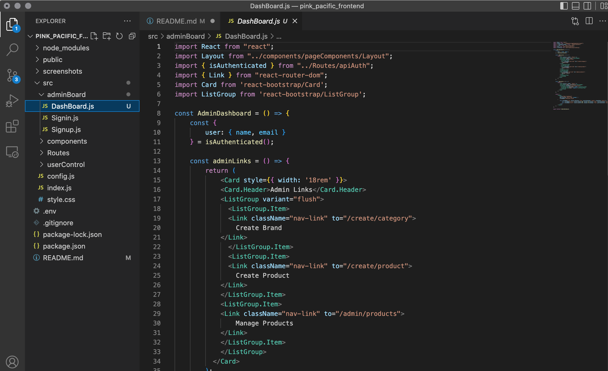
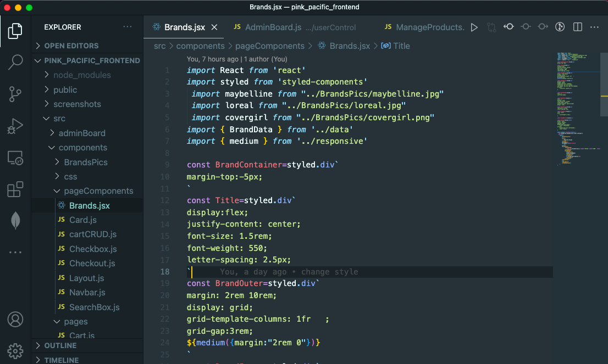

# Cosmetic Website

This project is designed for users to view and search for cosmetics, check for product descriptions ,shop and check out the items in the shopping cart. 

The live web can be found:

https://cosmetic-web-frontend-sarah.herokuapp.com/

## Project Overview

1. Three database collections: categories(to store the brand names of our cosmetic products), products(to store all our products information) and users(to store user information). Our website supports all 4 CRUD operations (create, read, update, delete) for each of the 3 database tables.
2. The web has the home page, the explore(list all products) page, the shopping cart page, the signin/signup page and a detail page for each product.
3. For Bootstrap UI component, I used Card, ListGroup and Button for our user/admin dashboard and for the display of products on the Home, Explore pages. We also used Image to display our logo.
4. The 3rd party library for React we used is styled-components. It is used in src/components/pageComponents/Brands.jsx. The use of this library is for displaying the three brands on the home page (In the “Featured Brands section in Home page)

use of bootstrap screenshot:

use of 3rd party library: styled-components screenshot

**Dependencies and Node version:**

Run npm install to install all the dependencies

Frontend:
node version: 18.1.0

Backend:
node version: 10.15.0
